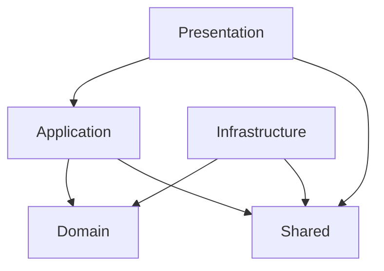

# JKFandom App Server

## 개요
JK 팬덤 앱의 백엔드 서버입니다. 소셜 로그인 인증을 통해 Firebase custom token을 발급하고,
온보딩/유저 관련 API를 제공합니다. 도메인 로직을 전달/인프라로부터 분리하기 위해
클린 아키텍처 구조를 따릅니다.

## 도메인 요약
- 소셜 로그인 사용자 식별 (Kakao, LINE, X)
- Firebase custom token 발급
- 유저 온보딩 및 프로필 데이터 관리

## 패키지 구조
Root package: `io.proto.jkfandom_app_server`

- `presentation`
  - 컨트롤러 및 API 경계 DTO
  - HTTP 예외 처리 (`@RestControllerAdvice`)
- `application`
  - 유스케이스/서비스 (오케스트레이션)
  - 앱 DTO 및 Command/Query
- `domain`
  - 엔티티/밸류/정책
  - 도메인 서비스
  - 리포지토리 포트(인터페이스)
- `infrastructure`
  - 영속성 구현 (JPA, MyBatis 등)
  - 외부 API 어댑터 (소셜 토큰 검증 등)
  - 보안/Firebase/설정
- `shared`
  - 공통 응답/에러 코드/예외

## 계층 의존성 도식

## 무엇이 어디에 들어가야 하나
- `presentation`
  - 요청/응답 DTO (HTTP 경계 전용)
  - 컨트롤러, Swagger 어노테이션
  - 인증 주체/헤더 처리
- `application`
  - 유스케이스(서비스) 오케스트레이션
  - 트랜잭션 경계
  - 커맨드/쿼리 DTO
- `domain`
  - 비즈니스 규칙/불변성/정책
  - 프레임워크 의존 없는 순수 로직
  - 포트(Repository 인터페이스)
- `infrastructure`
  - DB 접근 구현 (JPA/MyBatis/Mapper)
  - 외부 API 연동/웹클라이언트
  - 보안 필터, 설정
- `shared`
  - 공통 응답 래퍼
  - 전역 에러 코드 및 예외 정의

## 서비스 로직 vs 도메인 로직 분리 기준
- 도메인 로직
  - 비즈니스 규칙/불변성 검증
  - 외부 시스템, HTTP, 스프링에 의존하지 않음
- 서비스(유스케이스) 로직
  - 여러 도메인 객체/포트를 조합한 흐름 제어
  - 트랜잭션, 권한/상태 체크, 정책 적용 순서
- 프레젠테이션
  - 입력 검증 및 커맨드 변환
  - HTTP 응답 구성

## JPA / MyBatis / Mapper / DTO 배치 기준
- JPA
  - 엔티티: `domain` (비즈니스 모델)
  - Spring Data 리포지토리: `infrastructure/persistence`
  - 도메인 포트(Repository 인터페이스): `domain`
  - 구현 어댑터: `infrastructure/persistence`
- MyBatis
  - Mapper 인터페이스/SQL 매핑: `infrastructure/persistence`
  - 도메인 포트: `domain`
  - 어댑터를 통해 포트 구현
- Mapper DTO
  - DB 전용 DTO/레코드: `infrastructure/persistence/dto` 또는 `infrastructure/persistence/mapper`
  - API 요청/응답 DTO와 섞지 않기
- Application DTO
  - 유스케이스 입력/출력: `application/dto`
- Presentation DTO
  - HTTP 요청/응답 전용: `presentation/dto`

## 신규 기능 추가 흐름
1. 도메인 모델/포트 정의 (`domain`)
2. 유스케이스 구현 (`application/usecase`)
3. 인프라 어댑터 추가 (`infrastructure`)
4. API 컨트롤러 연결 (`presentation/controller`)
5. 공통 응답/에러 활용 (`shared`)
